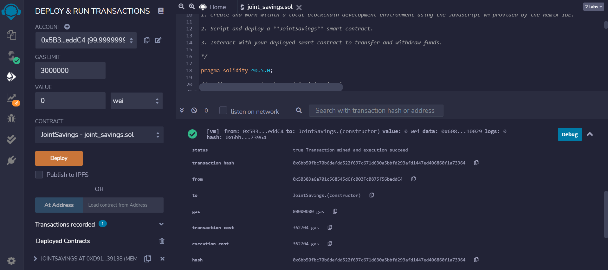

# Module_20_Challenge

This is a Solidity Smart Contract that connects financial institutions on a cross-border, ethereum-compatible blockchain.  This example transfers funds between two accounts in the form of deposits and withdrawals.

Deployed Contract:

---

## Technologies

This contract was written in Solidity 0.5.0

* [solidity](https://docs.soliditylang.org/en/v0.8.9/)

---

## Installation Guide

To run this contract, clone this repository and run the file 'joint_savings.sol' on your computer in the Remix IDE.

---

## Contributors

ABolla

---

## License

MIT